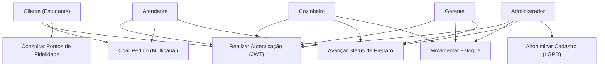
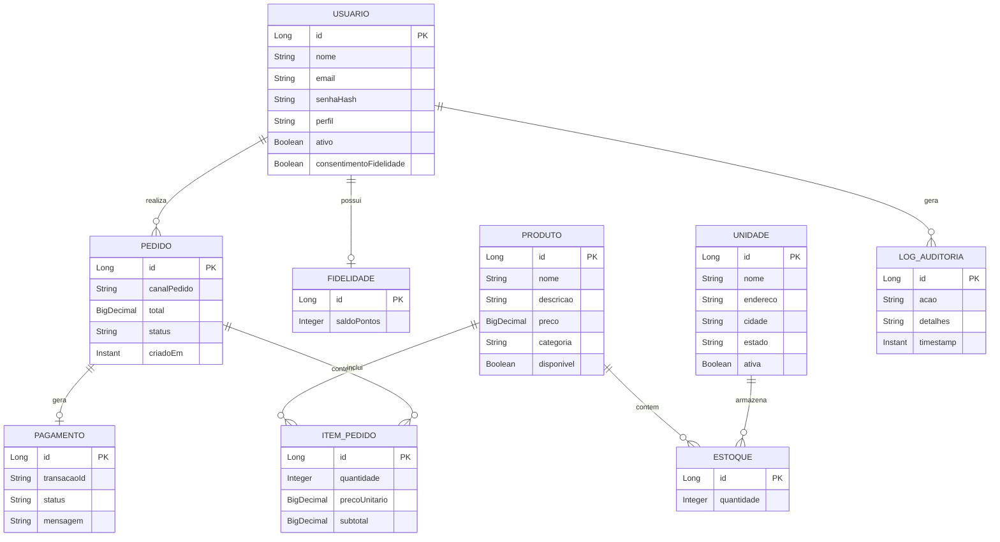
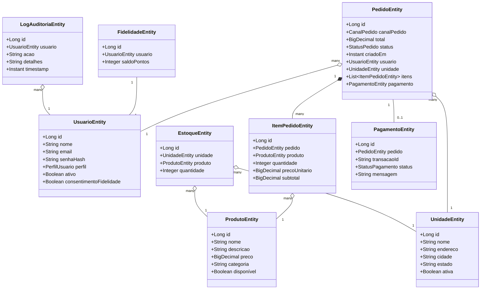
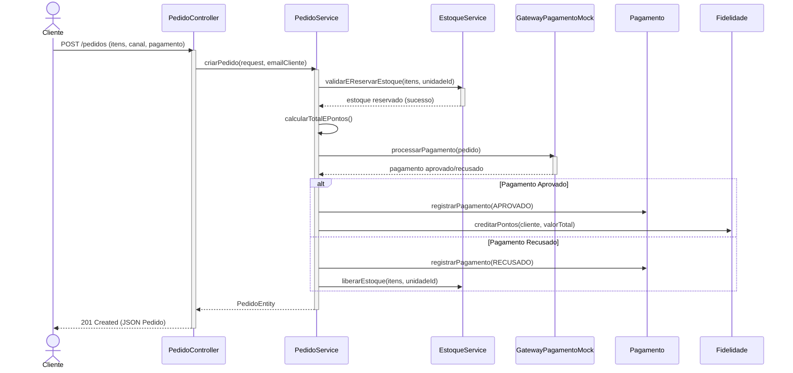
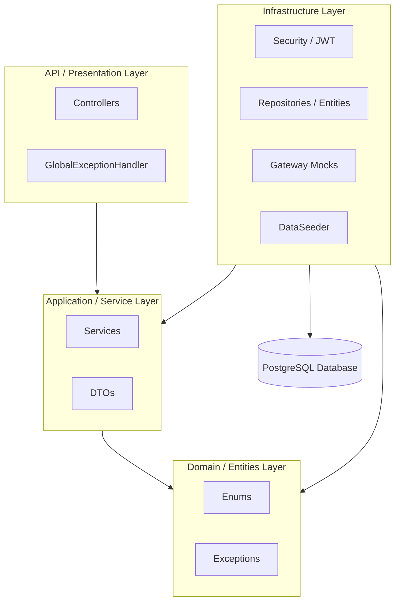

# Diagramas do Projeto — Raízes do Nordeste

Este arquivo contém as especificações dos diagramas do projeto em formato **Mermaid**. Você pode visualizá-los diretamente em visualizadores de Markdown compatíveis, exportá-los no [Mermaid Live Editor](https://mermaid.live/) ou importá-los no [Draw.io](https://app.diagrams.net/) (via *+ -> Advanced -> Mermaid*).

---

## 👥 1. Diagrama de Casos de Uso (Use Case)

Representa os atores do sistema e os principais fluxos de negócio que cada um realiza:

---

## 🗄️ 2. Modelo Entidade-Relacionamento (DER)

Modelagem relacional do banco de dados PostgreSQL contendo os relacionamentos e cardinalidades:

---

## ☕ 3. Diagrama de Classes (Camada Domain/Entities)

Diagrama das entidades de persistência JPA com seus tipos Java correspondentes e relacionamentos de orientação a objetos:

---

## 🔄 4. Diagrama de Sequência (Fluxo de Criação de Pedido)

O percurso síncrono e transacional desde o envio do JSON pelo Cliente até o fechamento financeiro mockado e crédito de pontos de fidelidade:

---

## 🏛️ 5. Diagrama de Arquitetura (Divisão por Camadas)

Visão geral da estrutura de pacotes da API, demonstrando o fluxo limpo de dependências:

